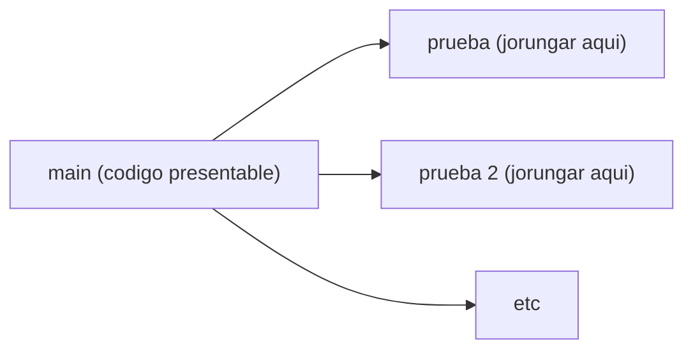

# Gestion
programacion 2 proyecto final

(nota: los .csv estan dentro de /debug si mi meoria no me falla)

antes de curucutear el codigo haganlo en la rama de pruebas para no esfaratar el main,
si hay una implementacion en proceso en la rama de prueba y creen que puedan joderla entonces
creen otra rama para ustedes solos a partir de la rama de prueba o la principal, ya luego organizamos 
que se queda y que no, pero por favor usen ramas pipipipipi



## Organizacion del proyecto y clases
bueno sucias he tratado que el codigo sea lo mas entendible y/o mantenible a pesar de ser de hace como 2 meses
la monda esta organizada asi:

### /MainClasses
en este archivo estan todas las clases jugosas para la funcionalidad, clientes, movimientos y asi, y el
superdupermegaimportante HerramientasCsv para que no nos partamos la cabeza (actualmente solo tiene para
convertir movimientos y clientes, faltaria adpatarlo para productos, personal (quizas facturas) etc
La clase negocio es el negocio en si, para guardar cositas como el nombre, los colores etc;

### /UiClasses
Aqui literal hay una sola clase para la paleta de colores del programa, lo unico que hace es guardar dos
colorsitos que combinan y que sean accesibles dentro de toda la interfaz del negocio mediante colorPrimario
y colorSecundario
oooobviamente hay una lista con varias posibles combinaciones de colores creada en el formulario de bienvenida
esas son las opciones de colores de todo el programa

## Jorungando archivos
como soy un neandertal y no supe utilizar los resources para manejar archivos fotos etc, el programa accede a los archivos asi:
```C#
string rutaDeLaAplicacion = AppDomain.Domain
```
esta linea consigue la ruta del compilado de la aplicacion dentro de la carbeta /debug

```C#
string rutaDelArchivo = Path.combine(rutaDeLaAplicacion + <"carpeta del archivo"> + <"nombre del archivo">)
```
esta linea devuelve la ubicacion directa del archivo que buscamos dentro del compilado, porque por alguna razon la ruta relativa no funciona asi tan facil (o soy estupido)
yo solo confio en que esta forma de manejar los archivos no sea un problema a la hora de convertir el programa a un ejectuable

## Los datagrids
estan implementados con `BindinList<>` entonces cada vez que se cambie algo en la lista se vera reflejado en el `DataGridView`
sin tener que actualizar manualmente, lo unico es que genera la data tal cual la clase, mismos nombres de atributos y todo (salvo que no sean publicos, sino no apareceran)
(no se que tan flexible sea esto si quieres meterle los botones al propio datagrid angel xd)

## Alterar los formularios
demas esta decir que en los archivos `.designer.cs` hay getters y setters para alterar o obtener cosas del formulario xd

## Cositas que faltan
- [ ] crear un .csv para los productos
- [ ] implementar pestana de trabajadores y personal (con su csv)
      
(lleno esta parte cuando lea los demas requisitos, quiero dormir xd)


