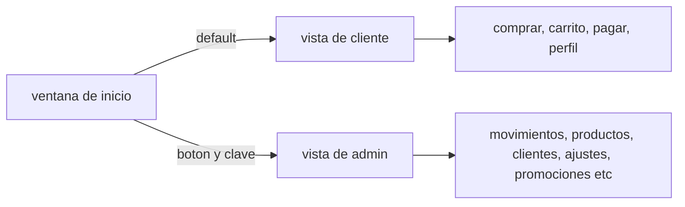

# Gestion
programacion 2 proyecto final

(nota: los .csv estan dentro de /debug si mi meoria no me falla)

antes de curucutear el codigo haganlo en la rama de pruebas para no esfaratar el main,
si hay una implementacion en proceso en la rama de prueba y creen que puedan joderla entonces
creen otra rama para ustedes solos a partir de la rama de prueba o la principal, ya luego organizamos 
que se queda y que no, pero por favor usen ramas pipipipipi


## Organizacion del proyecto y clases
bueno sucias he tratado que el codigo sea lo mas entendible y/o mantenible a pesar de ser de hace como 2 meses
la monda esta organizada asi:



### /MainClasses
en este archivo estan todas las clases jugosas para la funcionalidad, clientes, movimientos y asi, y el
superdupermegaimportante HerramientasCsv para que no nos partamos la cabeza (actualmente solo tiene para
convertir movimientos y clientes, faltaria adpatarlo para productos, personal (quizas facturas) etc
La clase negocio es el negocio en si, para guardar cositas como el nombre, los colores etc;

### /UiClasses
Aqui literal hay una sola clase para la paleta de colores del programa, lo unico que hace es guardar dos
colorsitos que combinan y que sean accesibles dentro de toda la interfaz del negocio mediante colorPrimario
y colorSecundario
oooobviamente hay una lista con varias posibles combinaciones de colores creada en el formulario de bienvenida
esas son las opciones de colores de todo el programa

## Jorungando archivos
como soy un neandertal y no supe utilizar los resources para manejar archivos fotos etc, el programa accede a los archivos asi:
```C#
string rutaDeLaAplicacion = AppDomain.Domain
```
esta linea consigue la ruta del compilado de la aplicacion dentro de la carbeta /debug

```C#
string rutaDelArchivo = Path.combine(rutaDeLaAplicacion + <"carpeta del archivo"> + <"nombre del archivo">)
```
esta linea devuelve la ubicacion directa del archivo que buscamos dentro del compilado, porque por alguna razon la ruta relativa no funciona asi tan facil (o soy estupido)
yo solo confio en que esta forma de manejar los archivos no sea un problema a la hora de convertir el programa a un ejectuable

## Los datagrids
estan implementados con `BindinList<>` entonces cada vez que se cambie algo en la lista se vera reflejado en el `DataGridView`
sin tener que actualizar manualmente, lo unico es que genera la data tal cual la clase, mismos nombres de atributos y todo (salvo que no sean publicos, sino no apareceran)
(no se que tan flexible sea esto si quieres meterle los botones al propio datagrid angel xd)

## Alterar los formularios
demas esta decir que en los archivos `.designer.cs` hay getters y setters para alterar o obtener cosas del formulario xd

## Cositas que faltan
dividir el programa en version admin y version para clientes, la del admin seria la que ya esta hecha pero hay que cambiar cositas y agregar cositas

### programa general
- [ ] crear un .csv para los productos
- [ ] agregar un campo para imagenes de los productos (final)
- [x] implementar un registro/inicio de sesion para clientes, esta sera la vista principal donde inicia el programa
- [x] agregar el campo "contrasena" al clientes.csv para poder validar su inicio de sesion o cuando se registren (si se van a registrar pedirles que ingresen dos veces la contrasena como se suele hacer)
- [x] el administrador accede a la version de admin mediante un boton y una constrasena x que pongamos nosotros en la pantalla principal
- [x] crear un archivo llamado negocio.csv para guardar ahi el nombre del negocio, el color y que se pueda cambiar desde la pestana ajustes en la vista de administrador
- [ ] integrar "metodos de pago" en ambas vistas, si queremos ponernos exoticos podemos pedir los datos de la tarjeta (numero, fecha, cvv) y validarlo con el algoritmo de luhn (eso se copypastea) para que sea un numero valido

### vista de admin
- [ ] (prioridad) implementar en los movimientos la compra y venta de varios productos a la vez con una ` List<producto> carrito ` (y restarlo o sumarlo del stock/cantidad), por cada elemento en la lista se ingresa o egresa un nuevo movimiento programaticamente
- [ ] (prioridad) agregar pestana pedidos con monitoreo (pendiente/enviado/entregado)
- [ ] (prioridad) agregar pestana promociones en la vista de admin donde se pueda alterar el precio de productos bajo ciertas condiciones, aqui tambien se va a llevar seguimiento de los cupones, descuentos y su creacion

### vista de clientes
- [ ] (prioridad) crear todo un modulo de clientes, enlazado directamente a los archivos clientes.csv y movimientos.csv y productos.csv donde el cliente pueda ver la informacion de sus productos adquiridos, nivel, cupones disponibles, todo tiene que manejarse mediante archivos para poder pasar la informacion entre perfiles
- [ ] (prioridad) implementar sistema de niveles para los clientes, que suban de nivel con mas compras y que ganen cupones
- [ ] (prioridad) implementar un carrito en la vista de clientes con `List<producto> carrito` para que el cliente pueda comprar varias cosas de una
- [ ] (prioridad) entrega automatica de cupones y recompensas al subir de nivel (literal un pase de batalla)
- [ ] (prioridad) implementar un historial de compras para el cliente (filtrando los movimientos de `movimientos.csv` que coincidan con su cedula)

---
especificaciones del doc

Especificaciones del Sistema para Tienda 
Desarrollar un sistema integral para gestionar las operaciones de una tienda en línea, incluyendo administración de productos, gestión de clientes, pedidos, promociones, niveles de clientes, regalos y cupones.
Requisitos Funcionales
1. Módulo de Administración
•	Gestión de productos: Registro y actualización de productos (nombre, descripción, precios, stock, imágenes).
•	Control de stock: Manejo automatizado de inventarios y alertas para reposición.
•	Gestión de pedidos: Visualización, seguimiento, actualización y procesamiento de pedidos recibidos.
•	Gestión de descuentos y promociones: Creación y administración de descuentos, ofertas temporales y promociones.
•	Gestión de niveles y recompensas: Administración de niveles de cliente, configuración de condiciones para subir de nivel, asignación de regalos y cupones.
2. Módulo de Clientes
•	Registro y autenticación: Registro de nuevos usuarios, login seguro con validación.
•	Perfil del cliente: Información personal, historial de compras, nivel actual, progreso hacia próximo nivel.
•	Carrito de compras: Capacidad de añadir, modificar o eliminar productos antes de confirmar compra.
•	Compras: Proceso de compra seguro, integración con métodos de pago.
•	Sistema de niveles: Clientes suben de nivel según cantidad o valor de compras.
•	Recompensas automáticas: Entrega automática de regalos o cupones al alcanzar ciertos niveles.


